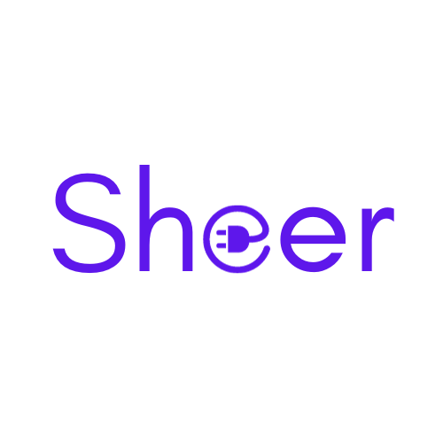

<a name="readme-top"></a>
<br />
<div align="center">
  <a href="https://github.com/tylermeekel/sheer">
    
  </a>

  <p align="center">
    Peer to Peer Filesharing
    <br />
    <br />
    <a href="https://github.com/tylermeekel/sheer/issues">Report Bug or Request a Feature</a>
  </p>
</div>


<!-- TABLE OF CONTENTS -->
<details>
  <summary>Table of Contents</summary>
  <ol>
    <li>
      <a href="#about-the-project">About The Project</a>
    </li>
    <li>
      <a href="#installation">Installation</a>
    </li>
    <li><a href="#usage">Usage</a></li>
    <li><a href="#roadmap">Roadmap</a></li>
    <li><a href="#contributing">Contributing</a></li>
    <li><a href="#license">License</a></li>
    <li><a href="#contact">Contact</a></li>
  </ol>
</details>


<!-- ABOUT THE PROJECT -->
## About The Project

<!-- [![Product Name Screen Shot][product-screenshot]](https://example.com) -->

Sheer is a Peer-to-Peer filesharing command-line application. It utilizes WebRTC to establish a secure and direct connection between two users.
<p align="right">(<a href="#readme-top">back to top</a>)</p>

## Installation
Install using Go install:
```
go install github.com/tylermeekel/sheer
```
<p align="right">(<a href="#readme-top">back to top</a>)</p>


<!-- USAGE EXAMPLES -->
## Usage
### Sending a file
```sh
sheer [send|s] [filepath]
```

### Receiving a file
```sh
sheer [receive|r]
```


<p align="right">(<a href="#readme-top">back to top</a>)</p>


<!-- ROADMAP -->
## Roadmap

- [ ] Ability to send directories
- [ ] Helper server that makes copy-pasting easier

See the [open issues](https://github.com/tylermeekel/sheer/issues) for a full list of proposed features (and known issues).

<p align="right">(<a href="#readme-top">back to top</a>)</p>


<!-- CONTRIBUTING -->
## Contributing

If you have a suggestion that would make this better, please fork the repo and create a pull request. You can also simply open an issue with the tag "enhancement".
Don't forget to give the project a star! Thanks again!

1. Fork the Project
2. Create your Feature Branch (`git checkout -b feature/AmazingFeature`)
3. Commit your Changes (`git commit -m 'Add some AmazingFeature'`)
4. Push to the Branch (`git push origin feature/AmazingFeature`)
5. Open a Pull Request

<p align="right">(<a href="#readme-top">back to top</a>)</p>


<!-- LICENSE -->
## License

Distributed under the MIT License. See `LICENSE` for more information.

<p align="right">(<a href="#readme-top">back to top</a>)</p>


<!-- CONTACT -->
## Contact

Tyler Meekel - ty.meekel@gmail.com

Project Link: [https://github.com/tylermeekel/sheer](https://github.com/tylermeekel/sheer)

<p align="right">(<a href="#readme-top">back to top</a>)</p>

<p align="right">(<a href="#readme-top">back to top</a>)</p>


<!-- MARKDOWN LINKS & IMAGES -->
<!-- https://www.markdownguide.org/basic-syntax/#reference-style-links -->
[contributors-shield]: https://img.shields.io/github/contributors/tylermeekel/sheer.svg?style=for-the-badge
[contributors-url]: https://github.com/tylermeekel/sheer/graphs/contributors
[forks-shield]: https://img.shields.io/github/forks/tylermeekel/sheer.svg?style=for-the-badge
[forks-url]: https://github.com/tylermeekel/sheer/network/members
[stars-shield]: https://img.shields.io/github/stars/tylermeekel/sheer.svg?style=for-the-badge
[stars-url]: https://github.com/tylermeekel/sheer/stargazers
[issues-shield]: https://img.shields.io/github/issues/tylermeekel/sheer.svg?style=for-the-badge
[issues-url]: https://github.com/tylermeekel/sheer/issues
[license-shield]: https://img.shields.io/github/license/tylermeekel/sheer.svg?style=for-the-badge
[license-url]: https://github.com/tylermeekel/sheer/blob/master/LICENSE.txt
[linkedin-shield]: https://img.shields.io/badge/-LinkedIn-black.svg?style=for-the-badge&logo=linkedin&colorB=555
[linkedin-url]: https://linkedin.com/in/tylermeekel
[product-screenshot]: images/screenshot.png
[Next.js]: https://img.shields.io/badge/next.js-000000?style=for-the-badge&logo=nextdotjs&logoColor=white
[Next-url]: https://nextjs.org/
[React.js]: https://img.shields.io/badge/React-20232A?style=for-the-badge&logo=react&logoColor=61DAFB
[React-url]: https://reactjs.org/
[Vue.js]: https://img.shields.io/badge/Vue.js-35495E?style=for-the-badge&logo=vuedotjs&logoColor=4FC08D
[Vue-url]: https://vuejs.org/
[Angular.io]: https://img.shields.io/badge/Angular-DD0031?style=for-the-badge&logo=angular&logoColor=white
[Angular-url]: https://angular.io/
[Svelte.dev]: https://img.shields.io/badge/Svelte-4A4A55?style=for-the-badge&logo=svelte&logoColor=FF3E00
[Svelte-url]: https://svelte.dev/
[Laravel.com]: https://img.shields.io/badge/Laravel-FF2D20?style=for-the-badge&logo=laravel&logoColor=white
[Laravel-url]: https://laravel.com
[Bootstrap.com]: https://img.shields.io/badge/Bootstrap-563D7C?style=for-the-badge&logo=bootstrap&logoColor=white
[Bootstrap-url]: https://getbootstrap.com
[JQuery.com]: https://img.shields.io/badge/jQuery-0769AD?style=for-the-badge&logo=jquery&logoColor=white
[JQuery-url]: https://jquery.com 